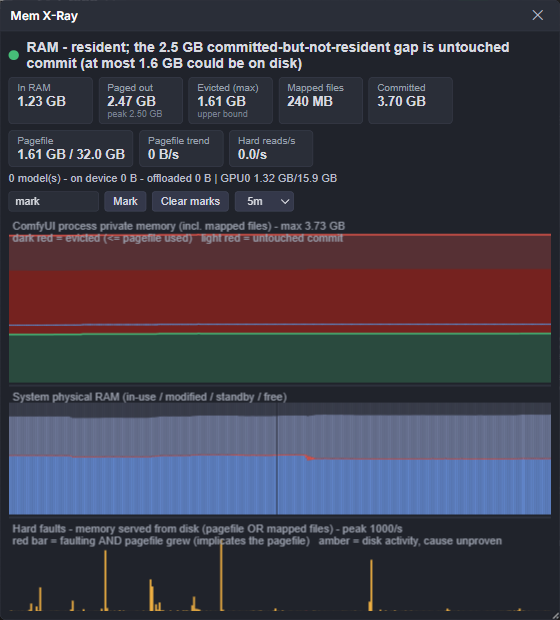

# ComfyUI Mem X-Ray

**Is ComfyUI actually caching your models in RAM, or has Windows quietly shoved them into the pagefile?**

You cannot answer that from Task Manager. It shows you a working set and a
commit size, but never *Private Bytes* and *Working Set - Private* side by
side — and the difference between those two is the entire question. So you end
up guessing: 64 GB of RAM, generations got slow, disk light is on, *probably*
swapping? Maybe?

This pack samples ComfyUI's own process once a second and draws the graph that
answers it directly, with a plain-language verdict at the top.



That screenshot is a real reading. It says: **RAM**. There is a 2.47 GB gap
between what ComfyUI committed and what is resident — which looks alarming —
but the pagefile is not growing, so that gap is address space that was
committed and never touched. Nothing was evicted. The amber bars at the bottom
are real disk reads, but they are memory-mapped `.safetensors` pages being read
in, not pagefile traffic.

Getting *that* distinction right is most of what this pack does.

---

## Install

```
git clone https://github.com/an80sPWNstar/ComfyUI-MemXray
```

into `ComfyUI/custom_nodes/`, so you end up with:

```
ComfyUI/custom_nodes/ComfyUI-MemXray/
```

Restart ComfyUI. No pip install step — the only dependency is `psutil`, which
ComfyUI already ships. Windows only (see [Caveats](#caveats)).

Press **Alt+M** for the floating panel, or open the **Mem X-Ray** sidebar tab.

---

## Reading the graph

The panel is three stacked graphs sharing one time axis, plus stat tiles and a
one-line verdict.

**Top graph — ComfyUI's private memory.** Green area is memory genuinely
resident in RAM. The red line above it is what the process committed. The band
between them is memory that is *not* in RAM, split into a dark-red lower slice
(could actually be on disk) and a lighter upper slice (untouched commit). The
thin blue line adds memory-mapped file pages.

**Middle graph — system physical RAM**, stacked: in-use / modified / standby
cache / free. Standby is not "used" memory; it is cache Windows will hand back
on demand.

**Bottom graph — hard faults**, one bar per second. This is memory access being
served from disk.

What the combinations mean:

| What you see | What it means |
| --- | --- |
| Green flat and high, red line sitting on it, no bars | Models are cached in RAM. Working as intended. |
| Amber bars, pagefile trend flat | Reading from disk — but from mapped model files, not the pagefile. Normal during a checkpoint load. |
| **Red bars, pagefile trend climbing** | The actual bad case. You are generating out of the pagefile. This is what makes things crawl. |
| Wide red band, no bars | Memory left RAM but nothing is reading it back. Costs you nothing until something touches it. Check the `Evicted (max)` tile before believing the whole band. |
| Blue line well above green, no red band | Lots of mmap'd model files. Normal for safetensors; those evict back to the model file, not the pagefile. |

The single most useful habit: **never read a fault bar on its own.** Check
whether the pagefile is growing at the same time. The panel colours the bars
red for you when it is.

---

## What it actually measures

The honest version, because a monitor that lies confidently is worse than no
monitor.

| Metric | What it is |
| --- | --- |
| **Private Bytes** | Private memory the process committed. Does *not* shrink when pages leave RAM. |
| **Working Set - Private** | The part of that currently resident in physical RAM. |
| **The difference** | Private memory not in RAM. See the warning below before reading this as "swapped". |
| **Working Set - private working set** | File-backed / mmap'd pages. safetensors weights live here, and they evict back to the model file on disk, **not** to the pagefile. |
| **Hard faults** (`\Memory\Page Reads/sec`) | Memory access served from disk — from *any* backing store. |
| **True pagefile bytes** | Read from the raw PDH `\Paging File(_Total)\% Usage` counter, where `FirstValue` is pages in use and `SecondValue` is total pages. Exact, unlike commit-charge arithmetic. |
| **`pagefile_delta`** | Bytes/sec the pagefile is growing. The one pagefile-specific signal available. |
| **`evicted_max`** | `min(non-resident private bytes, system pagefile bytes in use)` — an upper bound on what this process could have evicted. |

Two traps this pack exists to avoid, both verified on real hardware rather than
reasoned about:

> **A committed-vs-resident gap is not pagefile usage.** Measured: ComfyUI at
> 16.40 GB committed, 8.69 GB resident — a 7.72 GB gap — while the *entire
> system* pagefile held 1.75 GB. Most of that gap was address space committed
> and never touched, which is never written anywhere. A naive monitor screams
> "7.7 GB swapped!" Here the verdict correctly reads RAM.

> **Hard faults are not a pagefile counter.** Measured: 1330 reads/sec from
> simply importing torch and mapping a checkpoint, with zero pagefile growth.
> Only faults *plus* a growing pagefile escalate the verdict to PAGEFILE.

`evicted_max` is deliberately an upper bound and **not** an attribution — the
pagefile is system-wide, so a pagefile full of some other program's memory
would otherwise be blamed on ComfyUI.

Counters come from the **Process V2** PDH set, whose instance names are
`"<name>:<pid>"` — so it tracks *your* ComfyUI even with a dozen `python.exe`
running. It falls back to the classic `Process` set (resolving the right
instance by matching `ID Process` against the pid), and then to PSAPI, which
still gives Private Bytes and Working Set but loses the private/mapped split.

---

## Nodes

All four are optional — the panel works on its own. These exist for when you
want memory evidence attached to a specific run.

| Node | Purpose |
| --- | --- |
| **Mem X-Ray: Mark** | Drops a labelled marker on the timeline and returns a text report. Wildcard passthrough, so you can wire it inline anywhere without changing types — put one before and one after a checkpoint loader to see exactly what the load cost. |
| **Mem X-Ray: Chart** | Renders the timeline as an `IMAGE`, so you can save a picture of memory behaviour next to the image that run produced. |
| **Mem X-Ray: Delta** | Diffs now against N seconds ago, outputs the deltas in GB. |
| **Mem X-Ray: Guard** | Warns, or raises, when eviction crosses a threshold. A tripwire for long batch runs — leaves evidence in the log instead of you wondering why hour three was slow. |

---

## Verdict levels

Computed each sample from fault rate, `evicted_max`, and whether the pagefile is
growing (`pagefile_delta > 1 MB/s`). First match wins.

| Level | Condition | Meaning |
| --- | --- | --- |
| `alarm` | reads/s >= 300, and pagefile growing or `evicted_max` >= 2 GB | Heavy faulting, pagefile implicated |
| `alarm` | reads/s >= 50, `evicted_max` >= 512 MB, pagefile growing | Eviction and faulting and pagefile growth at once |
| `warn` | reads/s >= 300, pagefile flat | Heavy faulting, but against mapped files |
| `warn` | reads/s >= 50 | Faulting, not clearly attributable |
| `warn` | `evicted_max` >= 2 GB, no faulting | May be on the pagefile, but idle |
| `mapped` | mapped working set > 1 GB | Resident; largely mmap'd model files |
| `ok` | gap >= 512 MB, nothing above matched | Resident; the gap is untouched commit |
| `ok` | — | Resident, unremarkable |

---

## Caveats

- **Windows only.** The Private-Bytes-vs-private-working-set distinction is a
  Windows memory-manager concept. There is no equivalent reading elsewhere.
- Committed-but-never-touched memory counts as non-resident without ever having
  reached the pagefile. This is the big one; it is why the raw gap is not the
  headline number.
- Figures are for the ComfyUI process only. Other applications' pressure shows
  up in the system RAM panel but is not attributed.
- The pagefile is system-wide, so `evicted_max` is a ceiling, not a measurement
  of ComfyUI's own eviction.

---

## API

The panel is just a client; everything is available over HTTP.

- `GET /memxray/stats` — latest snapshot, static info (pid, PDH availability,
  which counter set is in use), and markers from the last 120 s. `sys` includes
  `pagefile_delta`; `proc` includes `evicted_max` and `untouched_commit`.
- `GET /memxray/history?seconds=300` — column-oriented backfill. Columns:
  `t, phys_total, in_use, standby, modified, free, pagefile_used, commit_total,
  private_ws, private_bytes, paged_out, evicted_max, pagefile_delta, mapped_ws,
  page_reads_sec, pages_input_sec, proc_faults_sec`.
- `POST /memxray/marker` — body `{ "label": "mark", "note": "" }`
- `POST /memxray/clear_markers`

Sampling runs in a background thread whether or not the UI is open, so opening
the panel mid-run still shows the history that led up to now.

---

## License

MIT. See [LICENSE](LICENSE).
