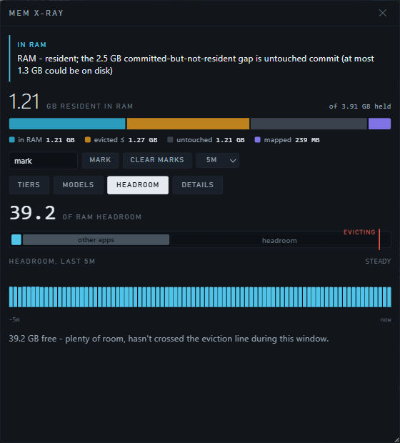

# ComfyUI Mem X-Ray

**Is ComfyUI keeping your models in RAM, or has Windows quietly pushed them into the pagefile?**

Windows only. MIT.


## Why I built this

I have 64 GB of RAM and generations still went to mud sometimes. Disk light on,
nothing obviously wrong, no way to prove what was happening. Task Manager was no
help: it shows you a working set and a commit size, but it will not put *Private
Bytes* and *Working Set - Private* next to each other, and the difference
between those two numbers is the entire question.

So you guess. And most of the guesses I saw online were wrong in the same way:
people see a big gap between "committed" and "in use", shout "it's swapping!",
and go buy more RAM. Usually that gap is memory the process reserved and never
touched. It costs nothing. It was never written anywhere.

This pack samples ComfyUI's own process once a second and draws the graph that
actually answers the question, with a plain-English verdict at the top that says
one of three words: **RAM**, **DISK**, or **PAGEFILE**.

The screenshot above is a real reading, and it's the case everyone gets wrong.
There's a fat gap between committed and resident, which looks terrifying, but
the pagefile isn't growing, so nothing was evicted. The amber bars at the bottom
are real disk reads, but they're memory-mapped `.safetensors` pages being read
in, not pagefile traffic. Verdict: in RAM. Nothing to fix.

Getting that distinction right is most of the work here. It's also why the
warning color is drawn as a dashed hairline instead of a filled block. A ceiling
you can't attribute to one process doesn't get to look like a measurement.

---

## Install

Two things to know before you start:

- **Windows only.** The Private-Bytes-vs-private-working-set split is a Windows
  memory manager concept. On Linux or macOS the pack will load and the nodes
  will register, but the sampler won't start and you'll get no data. I'm not
  going to fake numbers to be cross platform.
- **No pip install step.** The only dependency is `psutil`, which ComfyUI
  already ships. VRAM figures come from torch, which you obviously already have.

### Step 1 — find your `custom_nodes` folder

It's the folder that sits next to `main.py` in your ComfyUI install. Depending
on how you installed, it's one of these:

| How you installed | Path |
| --- | --- |
| Portable zip | `ComfyUI_windows_portable\ComfyUI\custom_nodes` |
| Cloned it yourself / venv | `<wherever you cloned>\ComfyUI\custom_nodes` |
| ComfyUI Desktop | under the base path you chose during setup, then `ComfyUI\custom_nodes` |

If you're not sure with Desktop, open **Settings → About** (or Server Config) and
look at the base path it reports, then go there and find the `ComfyUI` folder.
The rule never changes: **`custom_nodes` lives beside `main.py`.**

### Step 2 — get the files in there

Pick one. Git is easier to update later.

**With git** — open a terminal *in* the `custom_nodes` folder and run:

```
git clone https://github.com/an80sPWNstar/ComfyUI-MemXray
```

**Via ComfyUI Manager** — Manager → Install via Git URL → paste
`https://github.com/an80sPWNstar/ComfyUI-MemXray`.

**Without git** — download the ZIP from the green Code button, extract it, and
make sure you don't end up with the classic double folder. GitHub names the
extracted folder `ComfyUI-MemXray-main`, and inside it is another
`ComfyUI-MemXray`. Move the *inner* one.

Either way, when you're done it must look exactly like this:

```
ComfyUI/
  custom_nodes/
    ComfyUI-MemXray/
      __init__.py
      memxray/
      web/
```

If `__init__.py` isn't at that level, ComfyUI won't see it. That's the number
one install failure and it takes ten seconds to check.

### Step 3 — restart ComfyUI

Fully restart the server. Not a browser refresh — the Python side has to load.

### Step 4 — confirm it loaded

Look in the ComfyUI console for two lines like these:

```
[MemXray] sampling pid 26500 (python) via Process V2
[MemXray] watching pid 26500, PDH counters available
```

`Process V2` is the good case. If it says `PSAPI` instead, see
[When something's off](#when-somethings-off) below — it still works, it just
loses some resolution.

Second check, if you want to be sure the HTTP side is up: open

```
http://127.0.0.1:8188/memxray/stats
```

in a browser. You should get a wall of JSON. (Change the port if yours isn't
8188.)

### Step 5 — open the panel

Three ways, all equivalent:

- Open the **Mem X-Ray** tab in the left sidebar. This is the normal way in on
  any current ComfyUI build.
- Press **Alt+M** for the floating panel, which works everywhere.
- On older builds with no sidebar, a small **Mem X-Ray** button appears in the
  top right instead. Builds that have a sidebar don't get that button — it would
  be a third door to the same room, and the bottom-right corner it used to sit
  in belongs to ComfyUI's own canvas toolbar.

The floating panel is draggable and resizable, and it remembers where you put
it, what size it was, and which view you were on.

### Updating

```
git -C path\to\custom_nodes\ComfyUI-MemXray pull
```

Then restart ComfyUI. If you only see stale UI after an update, hard refresh the
browser with **Ctrl+F5** — the JS gets cached aggressively.

---

## Using it

The sampler runs in a background thread from the moment ComfyUI starts, whether
or not the panel is open. One sample a second, fifteen minutes of history kept
in memory. That matters: if a generation goes bad and *then* you open the panel,
the history that led up to it is already there.

At the top of the panel, always visible: the verdict, the headline number, and a
density strip showing how much of what ComfyUI holds is actually in RAM.

Below that, four tabs.

**Tiers** — where each loaded model is, as a labeled bar per model, over three
system lanes: VRAM, system RAM and the pagefile, with arrows for what's moving
between them. Most people already picture weights moving between VRAM and RAM.
This is the view that shows the third lane underneath, and the fact that Windows
moves things into it without asking. There's a "what's been happening" recap
under the lanes that reads out the window in sentences instead of making you
interpret a graph.

**Models** — per checkpoint instead of per byte, as a grid: rows are your loaded
models, columns are the four places a byte can actually be — **fastest (GPU)**,
**fast (RAM)**, **slow (disk)**, **not loaded (file)**. A model split across two
of them shows as a split row, so "half of it is on the card and the rest isn't
in RAM at all" is something you read rather than infer. This is the view that
tells you which model to unload.



**Headroom** — how much RAM is left before Windows starts evicting, with the
eviction line marked and a strip showing when you crossed it. The only
predictive view in here. It's the one that tells you not to start the 20 GB
render *before* you start it.

**Details** — the raw counters, three stacked graphs on one time axis. This is
where you go when you want to see the actual shape of what happened.

The window selector switches between **60s / 5m / 15m** and every view follows it.

### Markers

There's a text box and a **Mark** button in the panel controls. Type a label, hit
Mark, and you get a labelled vertical line on the timeline. Do it before and
after loading a checkpoint and the cost of that load is unambiguous instead of
"somewhere in this general area". **Clear marks** wipes them.

### The nodes

All four are optional. The panel works without any of them. These exist for when
you want memory evidence attached to a specific run.

| Node | What it does |
| --- | --- |
| **Mem X-Ray: Mark** | Drops a labelled marker on the timeline and returns a text report of memory state at that instant. It's a wildcard passthrough, so you can wire it inline anywhere without changing types. Put one before and one after a checkpoint loader. |
| **Mem X-Ray: Chart** | Renders the timeline as an `IMAGE` so you can save a picture of the memory behaviour next to the image that run produced. Inputs: `seconds` (10–900), `width`, `height`. |
| **Mem X-Ray: Delta** | Diffs now against N seconds ago. Outputs a report plus `paged_out_delta_gb` and `in_ram_delta_gb` as floats, so you can drive other logic with them. |
| **Mem X-Ray: Guard** | Warns (or raises, your choice) once eviction or hard faulting crosses a threshold. A tripwire for long unattended batches — it leaves evidence in the log instead of you wondering why hour three was slow. Defaults: 2 GB evicted, 100 reads/s. |

All four are under the **MemXray** category in the node menu. All four re-run
every queue rather than being cached as "unchanged", which is the point.

---

## Reading it

### The verdict line

Every reading starts with one of three words. Learn these and you can ignore
everything else most of the time.

| Word | What it means | What to do |
| --- | --- | --- |
| **RAM** | Resident. Your weights are in physical memory. | Nothing. |
| **DISK** | Memory is faulting in from disk, but the pagefile isn't growing — so it's mapped model files being read, not swapping. | Nothing, usually. Normal during a checkpoint load. |
| **PAGEFILE** | The bad one. Memory is coming back off the pagefile while you generate. | Unload a model, close something, or lower how much you're keeping resident. |

Internally these are four levels — `ok`, `mapped`, `warn`, `alarm` — and the
exact thresholds are in the table further down if you care.

### The Details graphs

**Top graph, ComfyUI's private memory.** The solid cyan block is memory genuinely
resident in RAM. Bright means present. Above it, a dashed amber line marks how
much *could* be on disk — dashed because that's a ceiling, not a measurement.
Above that, the faint void is committed address space that was never touched. The
violet line adds memory-mapped file pages.

**Middle graph, system physical RAM**, stacked: in use / modified / standby /
free. Standby is not "used" memory. It's cache Windows hands back the moment
something asks.

**Bottom graph, hard faults**, one bar per second. Memory access being served
from disk.

Now the part that actually matters — what the combinations mean:

| What you see | What it means |
| --- | --- |
| Cyan block deep and steady, dashed line low, no bars | Models cached in RAM. Working as intended. |
| Amber bars, pagefile trend flat | Reading from disk, but from mapped model files, not the pagefile. Normal during a checkpoint load. |
| **Red bars, pagefile trend climbing** | The actual bad case. You are generating out of the pagefile. This is what makes things crawl. |
| Cyan block shrinks, dashed amber line rises, no bars | Memory left RAM but nothing is reading it back. Costs you nothing until something touches it. |
| Big void above the cyan block, dashed line still low | Committed but untouched. Looks dramatic, costs nothing. This is the one everyone misreads as swapping. |
| Violet line well above the cyan block | Lots of mmap'd model files. Normal for safetensors — those evict back to the model file, not the pagefile. |

The single most useful habit: **never read a fault bar on its own.** Check
whether the pagefile is growing at the same time. The panel colors the bars red
for you when it is.

---

## What it actually measures

The honest version. A monitor that lies confidently is worse than no monitor.

| Metric | What it is |
| --- | --- |
| **Private Bytes** | Private memory the process committed. Does *not* shrink when pages leave RAM. |
| **Working Set - Private** | The part of that currently resident in physical RAM. |
| **The difference** | Private memory not in RAM. Read the warning below before calling this "swapped". |
| **Working Set - private working set** | File-backed / mmap'd pages. safetensors weights live here, and they evict back to the model file, **not** to the pagefile. |
| **Hard faults** (`\Memory\Page Reads/sec`) | Memory access served from disk, from *any* backing store. |
| **True pagefile bytes** | Read from the raw PDH `\Paging File(_Total)\% Usage` counter, where `FirstValue` is pages in use and `SecondValue` is total pages. Exact, unlike commit-charge arithmetic. |
| **`pagefile_delta`** | Bytes/sec the pagefile is growing. The only pagefile-specific signal there is. |
| **`evicted_max`** | `min(non-resident private bytes, system pagefile bytes in use)`. An upper bound on what this process *could* have evicted. Process-wide. |
| **Per-model placement** | Per page, for the address range of every weight tensor: `VirtualQuery` says what backs it (private → pagefile, mapped → the model file), `QueryWorkingSetEx` says whether it's in the working set. This is what makes the Models grid a measurement instead of a share-out. |

### Why the panel used to say "may be on the pagefile"

Because three things stood in the way, and it's worth knowing which ones are
gone:

1. **There is no per-process pagefile counter.** `\Process(*)\Page File Bytes`
   sounds like one and isn't — it's commit charge, the same number Task Manager
   calls "Commit size". The only exact pagefile figure Windows exposes is system
   wide. That one is still true, and it's why the process-level headline is still
   a ceiling.
2. **Non-resident private memory has two causes** — written to disk, or
   committed and never touched. Still not separable per page. Cross-checked
   against the system pagefile size instead.
3. **Nothing mapped bytes to a checkpoint.** That one is fixed: walk each
   model's tensors for their address ranges, then probe those ranges. The
   walk reads `data_ptr()` and `nbytes()` only, so probing a model can never be
   the thing that faults it back in.

Measured on a 3.16 GB memory-mapped safetensors: 8.2 ms to probe the whole range
at 256 KB granularity, 0 bytes resident before touching it and exactly 64 MiB
resident after touching 64 MiB. The probe runs every 5 s, not every second.

Two traps this whole pack exists to avoid. Both measured on real hardware, not
reasoned about:

> **A committed-vs-resident gap is not pagefile usage.** Measured: ComfyUI at
> 16.40 GB committed, 8.69 GB resident — a 7.72 GB gap — while the *entire
> system* pagefile held 1.75 GB. Most of that gap was address space committed and
> never touched, which never gets written anywhere. A naive monitor screams
> "7.7 GB swapped!". Here the verdict correctly reads RAM.

> **Hard faults are not a pagefile counter.** Measured: 1330 reads/sec from
> importing torch and mapping a checkpoint, with zero pagefile growth. Only
> faults *plus* a growing pagefile escalate the verdict to PAGEFILE.

`evicted_max` is an upper bound on purpose, and it is not an attribution. The
pagefile is system wide, so without that cap a pagefile full of some other
program's memory would get blamed on ComfyUI.

Counters come from the **Process V2** PDH set, whose instance names are
`"<name>:<pid>"`, so it tracks *your* ComfyUI even with a dozen `python.exe`
running. It falls back to the classic `Process` set (resolving the right instance
by matching `ID Process` against the pid), and then to PSAPI, which still gives
you Private Bytes and Working Set but loses the private/mapped split.

### Verdict thresholds

Computed each sample from fault rate, `evicted_max`, and whether the pagefile is
growing (`pagefile_delta > 1 MB/s`). First match wins, top to bottom. Only a
growing pagefile can raise an alarm: `evicted_max` alone latches (the pagefile
doesn't shrink promptly after a heavy run, so it would keep implicating the
pagefile in every later read spike for hours). Escalation is immediate;
de-escalation holds for 10 s so the verdict doesn't flicker under load.

| Level | Condition | Meaning |
| --- | --- | --- |
| `alarm` | reads/s ≥ 300, pagefile growing | Heavy faulting with the pagefile implicated |
| `alarm` | reads/s ≥ 50, `evicted_max` ≥ 512 MB, pagefile growing | Eviction, faulting and pagefile growth at once |
| `warn` | reads/s ≥ 300, pagefile flat, `evicted_max` ≥ 2 GB | Heavy faulting; could be pagefile read-back or mapped files — not attributable |
| `warn` | reads/s ≥ 300, pagefile flat | Heavy faulting, but against mapped files |
| `warn` | reads/s ≥ 50 | Faulting, not clearly attributable |
| `warn` | `evicted_max` ≥ 2 GB, no faulting | May be on the pagefile, but idle |
| `mapped` | mapped working set > 1 GB | Resident, largely mmap'd model files |
| `ok` | gap ≥ 512 MB, nothing above matched | Resident, the gap is untouched commit |
| `ok` | — | Resident, unremarkable |

---

## When something's off

**No Mem X-Ray button, no sidebar tab.** Hard refresh with Ctrl+F5. If it's still
missing, check the console for `[MemXray]` lines — if there are none at all, the
folder layout is wrong (back to Step 2).

**Panel says "backend unreachable - retrying every second".** The JS loaded but
the Python side didn't. Check the console for an exception at startup.

**Panel says "private working set unavailable - figures approximate".** PDH
couldn't open the process counter set, so it fell back to PSAPI. You still get
Private Bytes and Working Set, you lose the private/mapped split. This usually
means the Windows performance counters are corrupted, which happens more than it
should. Rebuilding them from an admin prompt (`lodctr /R`, then reboot) has fixed
it every time I've seen it.

**Nodes missing from the menu but the panel works.** The nodes import torch and
numpy lazily; a broken torch install takes out the Chart node specifically. Check
the console for `failed to load memxray.nodes`.

**Multiple ComfyUI instances.** Fine. Each instance samples its own pid, and the
Process V2 instance naming keeps them apart even though they're all `python.exe`.
Install the pack into each instance's `custom_nodes` separately.

---

## Caveats

- **Windows only**, for the reason at the top.
- Committed-but-never-touched memory counts as non-resident without ever having
  reached the pagefile. This is the big one, and it's why the raw gap isn't the
  headline number.
- Figures are for the ComfyUI process only. Pressure from other applications
  shows up in the system RAM graph but isn't attributed to anyone.
- The pagefile is system wide, so `evicted_max` is a ceiling, not a measurement
  of ComfyUI's own eviction.
- **Per-model placement is measured, but "out of RAM" is not the same claim as
  "on disk".** A page that has left the working set may still be physically in
  RAM on Windows' standby list, and no user-mode API reports that per page. So
  the Models grid says a model's bytes are out of RAM and names what backs them;
  it never says they are currently on the platter.
- **A private page that was committed and never written also reads as
  out-of-RAM**, because nothing distinguishes it from one that was paged out.
  The whole system pagefile is a hard ceiling on the second kind, so when the
  measured total exceeds it the Models view says the difference is untouched
  commit and costs nothing.

---

## API

The panel is just a client. Everything is available over HTTP if you want to
build something else on it.

- `GET /memxray/stats` — latest snapshot, static info (pid, whether PDH is
  available, which counter set is in use), and markers from the last 120 s. `sys`
  includes `pagefile_delta`; `proc` includes `evicted_max` and `untouched_commit`.
- `GET /memxray/history?seconds=300` — column-oriented backfill, up to 900 s.
  Columns: `t, phys_total, phys_avail, in_use, standby, modified, free,
  pagefile_used, commit_total, private_ws, private_bytes, paged_out, evicted_max,
  pagefile_delta, mapped_ws, page_reads_sec, pages_input_sec, proc_faults_sec`.
- `POST /memxray/marker` — body `{ "label": "mark", "note": "" }`
- `POST /memxray/clear_markers`

There's also an `analysis/` folder with the scripts I used to record long
sessions to SQLite and pull the numbers quoted above out of them. Start at
`analysis/README.md` if you want to do your own measuring.

---

## License

MIT. See [LICENSE](LICENSE).
